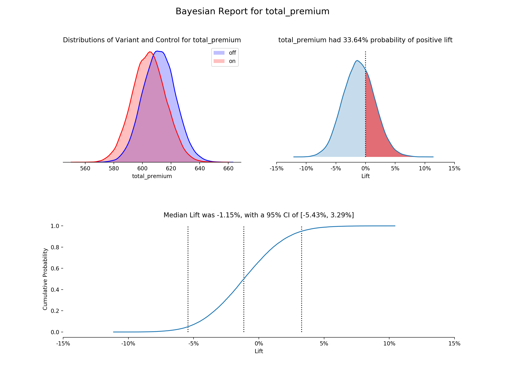

# Bayesian AB Test Report Builder


[](https://badge.fury.io/py/BayesABTest)

> **Baker Moran**

This allows AB testers to create a standard report for test results with python. Handles multiple variant tests, with a variety of prior function types. This is meant to be an abstraction from the nitty gritty of the details of Bayesian statistics. That said, some knowledge about which prior function to use etc. will be helpful for the user.

### Example Output for a conversion rate test



## Installation

- Install via pip (or specify pip3)

  ```bash
  pip install BayesABTest
  ```

  OR

- Download files from [PyPi](https://pypi.org/project/BayesABTest/#files) and install

## Package Functions and Classes

### [ab_test_model](docs/package_documentation/ab_test_model.md)

Class implementing out of the box AB testing functionality. Simple, easy to use AB testing with many different prior function types, all in one clean interface.

### [ab_test_dist_explorer](docs/package_documentation/ab_test_dist_explorer.md)

Functions allowing a user to explore different distributions with simple to user interface. Allows a user to visually learn about bayesian statistics, and inform proper prior function choice when doing Bayesian AB testing.

## Appendix

### Learning

For a documentation explaining and motivating the use of Bayesian statistics to evaluate A/B tests, see [documentation](docs/besyian_ab_testing/Bayesian_AB_Testing_explainer.md)

### Acknowledgements

There is a lot of documentation out there about a Bayesian framework of A/B testing. Some of the specific articles are listed below. Most of the work I came across was written in R, and I set out to create a Python implementation. The visuals were inspired by a standard template we use at Root, first written by <https://github.com/zachurchill-root>.

Articles Reference:

- <https://www.countbayesie.com/blog/2015/4/25/bayesian-ab-testing>
- <https://medium.com/convoy-tech/the-power-of-bayesian-a-b-testing-f859d2219d5>
- <https://cdn2.hubspot.net/hubfs/310840/VWO_SmartStats_technical_whitepaper.pdf>

### Version History

- `0.1.0-prealpha` - _12/02/2019_
- `1.0.0-alpha` - _12/27/2019_
- `1.0.1-alpha` - _01/02/2020_
- `1.0.2-alpha` - _06/17/2020_
- `1.0.3-alpha` - _06/17/2020_
- `1.0.4-alpha` - _06/22/2020_
- `1.0.5-alpha` - _06/22/2020_
- `1.0.6-alpha` - _06/22/2020_
- `1.0.7-alpha` - _07/09/2021_
- `1.0.8-alpha` - _03/29/2022_
- `1.0.9-alpha` - _03/29/2022_
