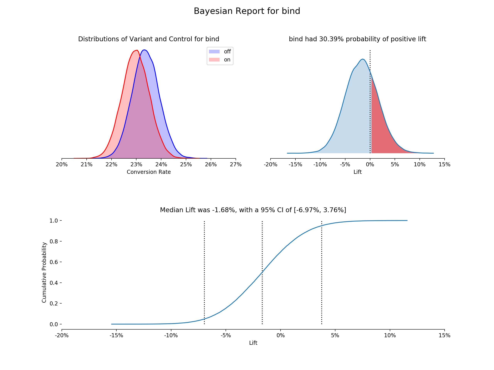
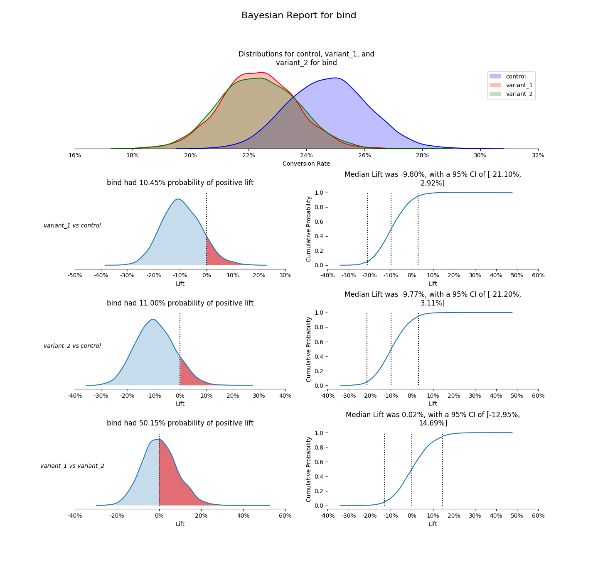
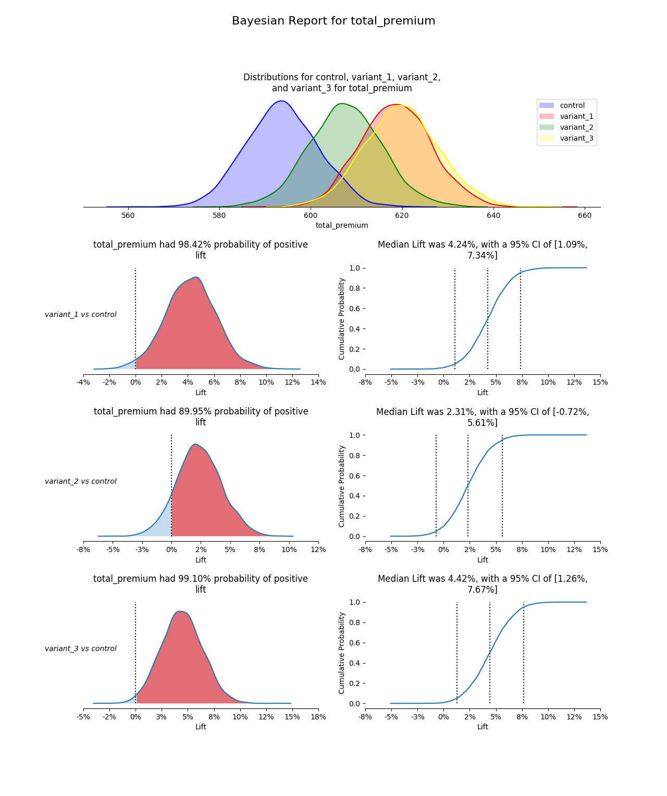
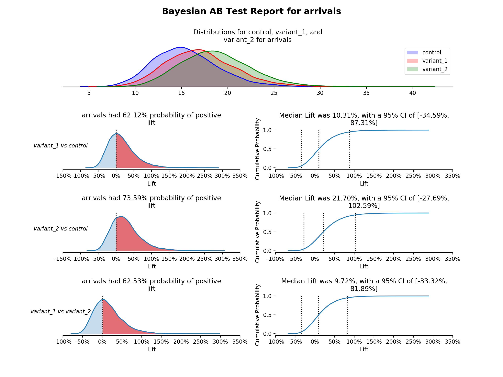

# Bayesian AB Test Report Builder

> **Baker Moran**

This is a package to allow AB testers to create a standard report for test results. Can handle conversion and continuous data. Can handle multiple variants.

Conversion data uses the beta distribution as the conjugate prior, and continuous data uses the log-normal.

## Instantiation variables

* `raw_data` - a pandas dataframe with (at least) two columns, one for the bucket and one for the response variable
* `metric` - column name in `raw_data` for the response variable
* `bucket_col_name` - column name in `raw_data` for the bucket (defaults to `bucket`)
* `control_bucket_name` - value in `bucket_col_name` for the control bucket (defaults to `off`)
* `samples` - number of samples to run the monte carlo simulation, must be 1,000 and 50,000 (defaults to 10,000)
* `prior_func` - the type of distribution to use for the prior. options include:
  * `beta` - use for conversion rates. bounded on the interval [0,1]
  * `log-normal` - use for continuous, greater than zero response variables (0, +inf) (ex: premium, minutes spent on scene, etc.)
  * `normal` - use for continuous response variables that on the interval (-inf, +inf)
  * `poisson` - use for discrete, greater than zero response variables (ex: arrivals per day, events per account, etc.)
* `prior_info` - the prior belief to about the response varable. options include:
  * `uninformed` - no prior belief about the response, all outcomes are equaly likely. No input required to use
  * `informed` - uses and empirically informed prior (informed by the control data), and weakens this prior by `prior_scale_factor`
  * `specified` - allows for a user to input prior parameters
* `prior_parameters` - `prior_info` must be set to `specified`. This must be a dictionary with the following key value pairs:
  * `prior_func` = `beta` - keys are `alpha` and `beta`
  * `prior_func` = `log-normal` - keys are `mean` and `var`
  * `prior_func` = `normal` - keys are `mean` and `var`
  * `prior_func` = `poisson` - keys are `alpha` and `beta` OR `mean` and `var`
* `confidence_level` - value for the confidence interval on the CDF chart (defaults to `0.05`)
* `compare_variants` - boolean for comparing the variants to each other. Control to each variant is always done (unless there are too many variants to plot). If there are few enough variants, the comparisons for variants will be plotted. (defaults to `False`)
* `debug` - boolean to print out extra output for debugging purposes (defaults to `False`)
* `prior_scale_factor` - factor to scale an empirically informed prior by (defaults to `4`)

## Public class methods and variables

### Methods

* `fit()`
  * *requires* - class was instantiated with valid inputs
  * *modifies* - `ecdf`, `control_sample`, `variant_sample`, `lift`
  * *effects* - creates and runs the monte carlo simulation, sets member variables to reflect model outputs
* `plot(lift_plot_flag=True)`
  * `lift_plot_flag` - boolean for plotting lift PDF and CDF (defaults to `True`)
  * *requires* - `fit()` has been run
  * *modifies* - none
  * *effects* - creates a 3 chart report of the AB test. (must show with `matplotlib.pylot.show()`)
* `plot_posteriors(variants=[]):`
  * *requires* - variants is a list of variant names in `bucket_col_name`. One variant may not be repeated multiple times.
  * *modifies* - none
  * *effects* - creates a posterior plot of these variants (must show with `matplotlib.pylot.show()`)
* `plot_positive_lift(variant_one, variant_two)`
  * *requires* - variant_one and variant_two are variant names in `bucket_col_name`. One variant may not be repeated multiple times.
  * *modifies* - none
  * *effects* - creates a positive lift plot between these variants (must show with `matplotlib.pylot.show()`)
* `plot_ecdf(variant_one, variant_two)`
  * *requires* - variant_one and variant_two are variant names in `bucket_col_name`. One variant may not be repeated multiple times.
  * *modifies* - none
  * *effects* - creates an empirical cumulative distribution plot of these variants lift (must show with `matplotlib.pylot.show()`)

### Variables

* all variables in `Instantiation variables`
* `ecdf` - a 3 level dicitonary, where key1 is a the variant name of the numerator in the lift calculation, and key2 is the variant name of the denominator in the lift calculation. The third keys are `x` and `y`, and the value is a list containing the x and y coordinates for the empirical CDF (only meaningful after `fit()` is run)
* `lift` - a 2 level dicitonary, where key1 is a the variant name of the numerator in the lift calculation, and key2 is the variant name of the denominator in the lift calculation. The value is a list containing the lift of the variant over the control for each sampled value (only meaningful after `fit()` is run)
* `posteriors` is a dictionary, where the key is a variant name, and the value is a `posterior_distribution` object.

## Usage guide

First install package. Navigate to the directory in terminal and pip install it.

```bash
cd BayesABTest
pip3 install -e .
```

Second, import in your analysis file.

```python
import pandas as pd
from BayesABTest import ab_test_model

# read in data
df = pd.read_csv('some_file.csv')

# initialize class with the data and some optional variables
first_test = ab_test_model(df, metric='bind', prior_info='informed', prior_func='beta', debug=True)

# run public methods
first_test.fit()
first_test.plot()
```

## Example output

### Chart Type Descriptions (Top Left -> Clockwise)

* **Posterior Distributions** - Shows both buckets posterior distributions, an estimate of the true conversion rate or continuous value, based on the prior and the observed data (using kernel density estimation plots)
* **Lift PDF** - Shows the probability density distribution of lift for the variant over the control, an estimate of the chance of improvement of the variant over the control (using kernel density estimation plot). Calculated by: the results from the sampled values for the variant percent change from the control. The proportion greater than 0 is highlighted.
* **Empirical CDF of Lift**å - Uses the same lift vector, but is the empirical cumulative distribution function. Median lift is highlighted and labeled, as well as the chosen confidence interval.

### Conversion Rate Example (Beta Distribution)



### Continuous (Positive) Variable Example (Log-Normal Distribution)


### Two Variant Conversion with Compare Variants



### Three Variant Continuous without Comparing Variants



### Two Variant Poisson with Comparing Variants



### Version History

* `0.1.0` - *12/02/2019*
* `1.0.0` - *12/27/2019*
* `1.0.1` - *01/02/2020*
* `1.0.2` - *02/11/2020*
* `1.0.3` - *02/21/2020*

### Acknowledgements

There is a lot of documentation out there about a Bayesian framework of A/B testing. Some of the specific articles are listed below. Most of the work I came across was written in R, and I set out to create a Python implementation. The visuals were inspired by a standard template we use at Root, first written by <https://github.com/zachurchill-root>.

Articles Reference:

* <https://www.countbayesie.com/blog/2015/4/25/bayesian-ab-testing>
* <https://medium.com/convoy-tech/the-power-of-bayesian-a-b-testing-f859d2219d5>
* <https://cdn2.hubspot.net/hubfs/310840/VWO_SmartStats_technical_whitepaper.pdf>
